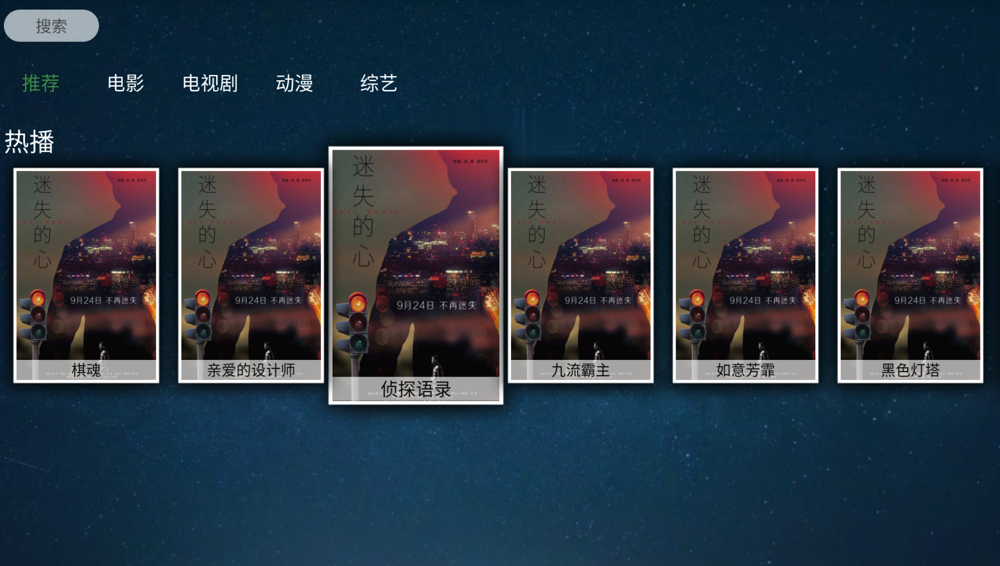
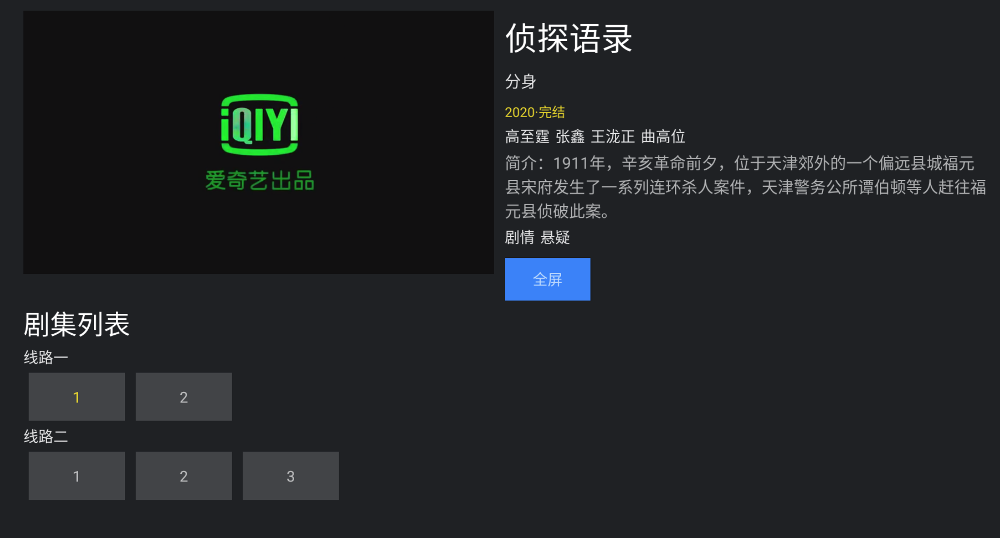
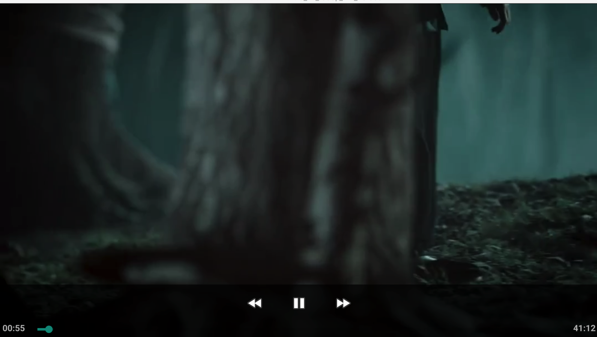
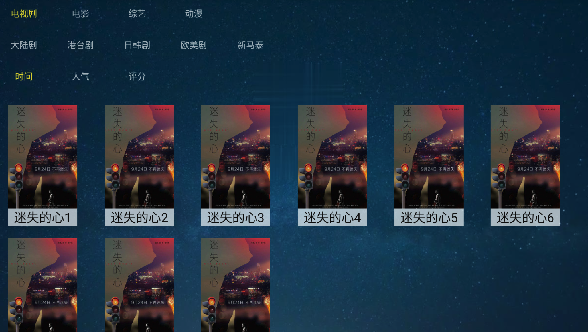
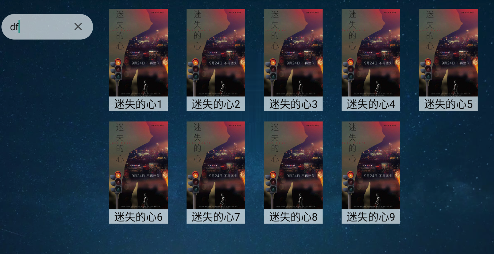

## 简介
android TV 的demo版

主要实现了 影片首页, 搜索,全部剧集，剧集详情页，播放页

## 实现说明
本期为了实现快速，直接采用的开源的widget实现 

首页的Tab使用的 https://github.com/zhousuqiang/TvTabLayout

图片等相关View使用的 https://gitee.com/kumei/AndroidTVWidget

## 自定义片源
* 实现接口 TVExtractor 

参考Demo.java实现
* **App** 类返回对应的`Extractor`
```
    public static TVExtractor getTVForSearch() {
        return new Demo();
    }

```
## TODO
* 自定义tab，图片，ListView，等相关widget。目前这块代码有点乱，很多样式写在java代码里了
* 全屏播放弹出控制栏，支持切换集数，视频控制等

https://www.jianshu.com/p/705a6cb6bfee
https://www.jianshu.com/p/1fac598febc1
https://www.jianshu.com/p/a48960270849
## 效果展现










