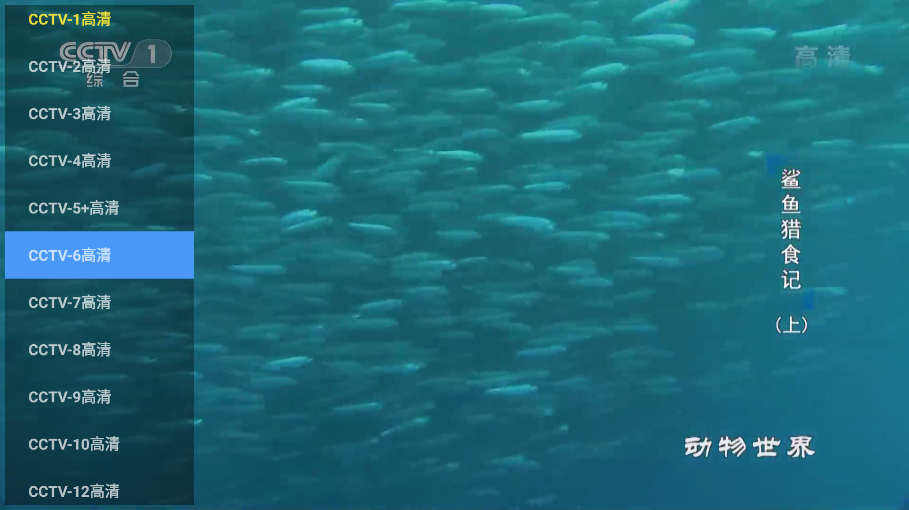

## 简介
定制自家的android TV 

主要实现了 影片首页, 搜索,全部剧集，剧集详情页，播放页
以及电视直播功能

## 实现说明
本期为了实现快速，直接采用的开源的widget实现 

首页的Tab使用的 https://github.com/zhousuqiang/TvTabLayout

图片等相关View使用的 https://gitee.com/kumei/AndroidTVWidget

## 自定义片源
* 实现接口 TVExtractor 

参考Demo.java实现
* **App** 类返回对应的`Extractor`
```
    public static TVExtractor getTVForSearch() {
        return new Demo();
    }

```

## 效果展现




## 扩展阅读
https://www.jianshu.com/p/705a6cb6bfee
https://www.jianshu.com/p/1fac598febc1
https://www.jianshu.com/p/a48960270849
https://blog.csdn.net/qq_38436214/article/details/104689266